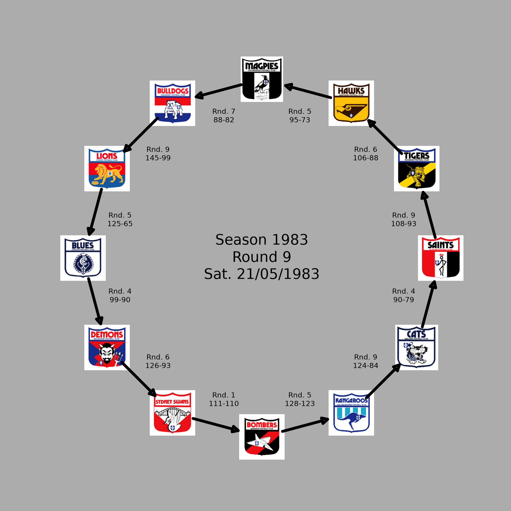

# AFL-Parity

DFS search of AFL season to determine the when the first [hamiltonian cycle](https://en.wikipedia.org/wiki/Hamiltonian_path) occured each season (if at all).
Makes use of [Squiggle's](https://api.squiggle.com.au/#section_bots) wonderful API to get data, many thanks Squiggle for provide such a neat service.  

Purposefully built with Python rather than Go or C++ to highlight how conditional efficiencies, early-exit strategies, and understanding of desired outcomes all provide true value when trying to optimise solutions rather than relying on raw power.  Using a high-level language forces optimisations strategies rather than just brute-forcing a way through with compute and running it all on metal.  

A good example of the benefits of these efficiencies were observed when traversing Season 2000. Traversing the entire season took _~610 million_ steps and nearly 2 hours to find the first occuring hamiltonian cycle, but by employing conditional efficiencies this code is able to find the first hamiltonian cycle of the season in _~302_ steps in ~1.87 seconds for the same season.  Running for every season (1897-2026) sequentially takes ~161 seconds.  

This is just a little fun project to apply DFS and play around with graph structures. What fun.

Results are present on their own little preso page here: [AFL-Parity](https://github.com/mctipper/afl-parity).

## Output

The output for each season is found in `output/<season>/`, with a `json` doc contained some details on the traversal, along with the details of the hamiltonian cycle (if found), and the game results of each that make up said hamiltonian cycle. A crude infographic is also generated for each also.  
There's also single combined `json` doc in the `output/` dir, but doesn't include all the game details because that would just be silly really.  

All the outputs are already provided in the repo.  

  
 
<em>Example Infographic for AFL Season 1983</em> 
<em>Yeah it's proper crude</em>

## DFS

Depth-First-Search is a well suited as it has better memory space than Breadth-First-Search. We're literally looking for _full hamiltonian cycles only_ so we only need to keep the current path in memory at any one time, as it contains all the information we need in order to proceed correctly. Just makes sense.  As DFS is a linear algorithm, it isn't particularly assisted by parallism, especially for hamiltonian cycles, since each thread will all arrive at the exact same hamiltonian cycle(s) (but slightly offset due to different starting nodes, e.g. 1-2-3-4 is the same as 3-4-1-2 in this scenario).  

While time complexity for DFS is **O(V + E)** (**V**ectors plus **E**dges), the special requirement for a hamiltonian cycle makes it **O(n^n)** as its possible that every node must visit every other node. Space complexity remains **O(n)** as we only record a single path at a time, which is sweet.  

### Efficiencies

As we are searching only for the _first_ hamiltonian cycle per season, it allows some efficiencies when traversing. These have all been coded in to allow for (potentially...) quicker computation:

#### 1. All winners and losers  
Obvious one first: every team has either won or lost at least one match. No point traversing otherwise.
  
#### 2. Sequentially run, by round  
By checking results by round, there are less permutations to traverse and thus the first hamiltonian cycle will be quicker to reveal itself.  
Most beneficial when it happens to occur 'earlier' in the season, and the benefits on this sequential approach are reduced when it occurs later in the season.
  
#### 3. First outcome for a team  
By checking if that particular round include the first win or loss for a particular team, start the search with that winner and dismiss all other combinations. Any hamiltonian cycles found using that game simply cannot be bettered and can exit early. In a particular round, multiple teams may have their first win or first loss, so each is considered as a unique start for a traversal.

  
#### 4. Start each round with the first game of the round  
Should a 'first outcome' not be apparent in that round, might as well start with the winner of first game of the round, if that permutation containing the first game of the round results in a hamiltonian cycle, then the result cannot be bettered and can exit early - else can just use all that teams than won the first matches of the round as a base parent (plural because there can be multiple simulatious 'first games of the round')

  
#### 5. Game occured after current hamiltonian cycle  
Again once a hamiltonian cycle has been found (which doesnt include the first game of the round, or a first event), before traversing next game check if it occured after the current last occuring game in the known hamiltonian cycle. If it occured after, there is no way the addition of that game improve on the result, so it can be skipped.  
While it is easy to count this as a single skipped step, by skipping these games it can prevent many hundreds or even thousands of pointless permutations.

  
#### 6. Multi-Threadding  
As DFS is a linear search algorithm, it requires a bit of a nudge to benefit from parallel processing. One such method is by undertaking the 'first step' of a DFS search (ie. a BFS search, a single parent and all their children) and starting a thread for each fan-out. While we have multiple possible early exit strategies, searching in parallel is always a good idea as it allows for potential early-exit outcomes to be found sooner, and by declaring a `EarlyExitState` object that controls the threads, all threads can terminate quickly should one be found on _any_ thread.  

  
#### 7. Backtrack-limiting  
Prevent backtracking from going 'too far', when beginning with a path > X length, want to ensure path backtracking doesnt go beyond this point, causing different threads to eventualy compute the exact same permuations.  

  
### Efficiency Notes

All these efficiencies combined have resulting in it only taken a combined _~4 minutes and 25 seconds_ to download the data, build the adjacency lists, traverse the graphs to find the first hamiltonian cycle of each season, and draw those awful infographics for all seasons from 1897 to 2026. Hardware annoyances aside (my cpu isn't even that good really) so this is all about massaging that algorithm until it's optimal for a particular use-case. Make the most of restrictions and conditions as _they actually simplify_ things when coded for. The bottleneck is actually downloading the data each season, not the actual algorithm.

While all the above greatly improve performance and reduce computation time for traversing, they do not guarentee it and still rely on some favourable qualities in order to be taken advantage of. The key thing to remember here is understanding the data, the outcomes, and the algorithms themselves allow you to provide neat little hacks and shortcuts to reach goals and outcomes quicker. It is the combination of all the efficiencies that enable traversals to be done quickly, not just one individually or just throwing crazy parallel-epic-super-compute at it all.

## How to run

First run sync up via [uv](https://github.com/astral-sh/uv) use command `uv sync` to get correct python versioning and environment management locally etc...

Run for a single season:  
> `uv run python main.py -s 2024`

Run for all seasons:
> `uv run python main.py -a`

Optional `-d` flag for verbose logging, logs every single step performed during the DFS search so yeh probs dont run that with the `-a` flag lol.  

### Logs

Logs are stored in the `.logs/` dir, with a single file per execution, named by DATE_TIME_LOGTYPE. There are 'main' logs which provide simple progress and outputs. If debug switch was provided, each individual thread gets it's own log output detailing _every step undertaken_ in the traversal.
