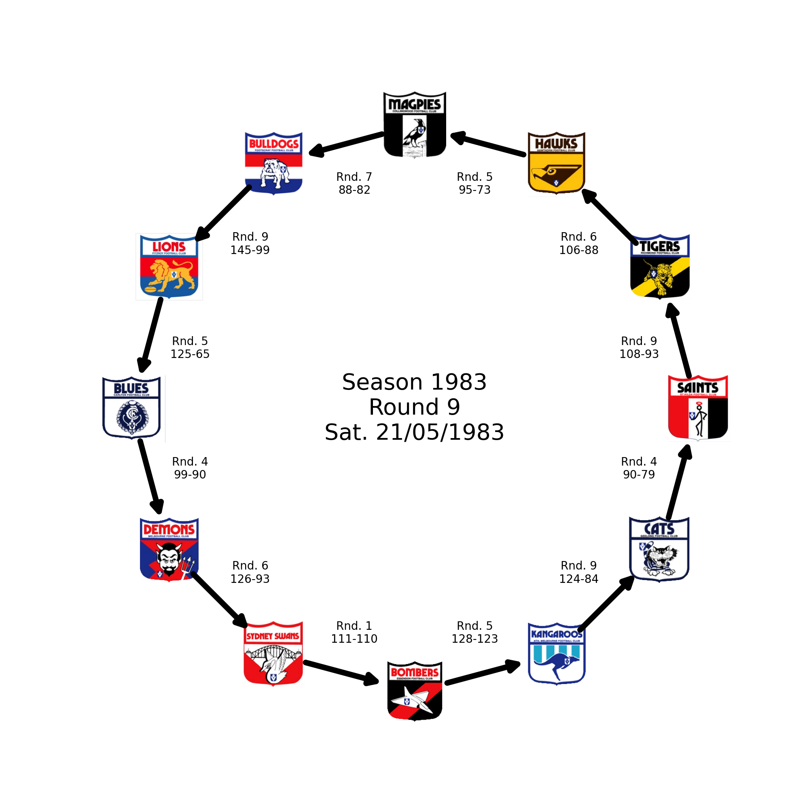

# AFL-Parity


DFS search of AFL season to determine the when the first [hamiltonian cycle](https://en.wikipedia.org/wiki/Hamiltonian_path) occured each season (if at all).
Makes use of [Squiggle's](https://api.squiggle.com.au/#section_bots) wonderful API to get data, many thanks Squiggle for provide such a neat service.  

This is just a little fun project to apply DFS and play around with graph structures. What fun.

## Output

The output for each season is found in `output/<season>/`, with a `json` doc contained some details on the traversal, along with the details of the hamiltonian cycle (if found), and the game results of each that make up said hamiltonian cycle. A crude infographic is also generated for each also.  
There's also single combined `json` doc in the `output/` dir, but doesn't include all the game details because that would just be silly really.  

All the outputs are already provided in the repo.  

<div align="center">
  
<br>
<em>Example Infographic for AFL Season 1983</em><br>
<em>Yeah it's proper crude</em>
</div>

## DFS

Depth-First-Search is a well suited as it has better memory space than Breadth-First-Search. We've literally looking for full hamiltonian cycles only so we only need to keep the current path in memory at any one time. Just makes sense.  But it's also a linear algorithm, and isn't particularly assisted by parallism, especially for hamiltonian cycles, since each thread will all arrive at the exact same hamiltonian cycle(s) (but slightly offset due to different starting nodes)

While time complexity for DFS is **O(V + E)** (**V**ectors plus **E**dges), the special requirement for a hamiltonian cycle makes it **O(n^n)** as its possible that every node must visit every other node. Space complexity remains **O(n)** as we only record a single path at a time, which is sweet.  

## How to run

Easiest is with `vscode devcontainers`. Just need to open this repo in a devcontainer and all the environment hassle is taken care of. So very neat.  

Otherwise can use [uv](https://github.com/astral-sh/uv) for python versioning and environment management locally or however you like really. Just use `uv` its great.  

There is also a generic `Dockerfile` outside of the devcontainer which can be used to spin up a dedicated container too if wanting. 

### Execution

A helper script can be found in `scripts/run.sh`. Need to provide argument after to indicate which season want to perform a hamilton cycle search on. So for season 2023 would use:
```
sh scripts/run.sh -s 2023
```

To run all seasons sequentially:
```
sh scripts/run.sh -s all
```

There is also a `-d` switch to provide debug logs, which contain every step of the search... yeah they get kinda big... probs best not to run this with the `-s all` switch.
